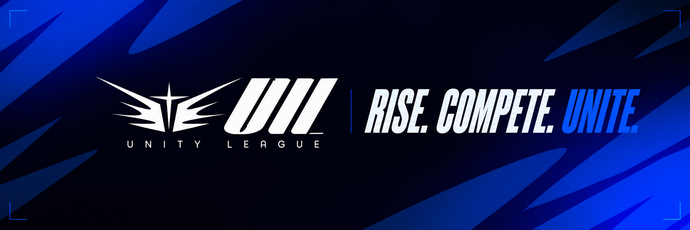

  

# Unity League

**Rise. Compete. Unite.**

Unity League is an amateur League of Legends tournament community built around competition, teamwork, and shared Christian values.

We create tournaments and broadcasts that bring players together, help new relationships grow, and give amateur competition the atmosphere it deserves.

This GitHub organization hosts the software and technical tools behind our tournaments and live broadcasts.
